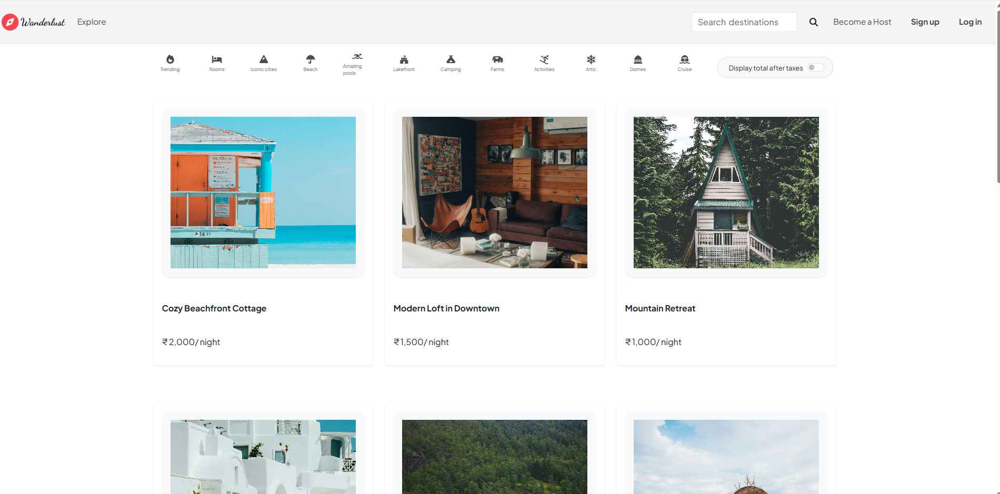
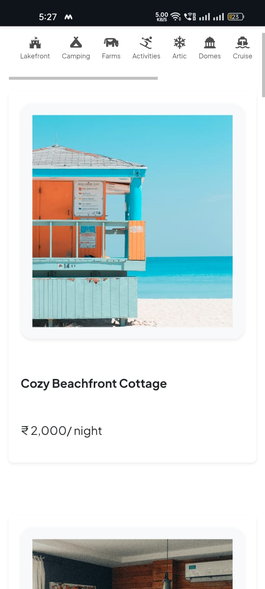

# 🌍 Wanderlust – Full‑Stack Travel Listing Web App

Wanderlust is a full‑stack travel listing web application inspired by platforms like Airbnb. It allows users to explore destinations, create listings, upload images, and manage content with secure authentication — all deployed live for real‑world usage.

🔗 **Live Demo:** [https://wanderlust-0g0s.onrender.com/listings](https://wanderlust-0g0s.onrender.com/listings)
💻 **GitHub Repository:** [https://github.com/muktijain/Wanderlust](https://github.com/muktijain/Wanderlust)

---

## ✨ Features

* User authentication (Sign up / Login / Logout)
* Create, edit, and delete travel listings (CRUD operations)
* Image upload with cloud storage
* Location-based listings with map integration
* Flash messages for better UX
* Secure authorization for protected routes
* Fully responsive design (mobile, tablet & desktop)

---

## 🔧 Tech Stack

### Frontend

* EJS (Embedded JavaScript Templates)
* HTML5, CSS3
* Bootstrap (Responsive UI)

### Backend

* Node.js
* Express.js
* RESTful APIs

### Database

* MongoDB
* Mongoose (ODM)

### Authentication & Security

* Passport.js
* Session-based authentication
* Authorization middleware

### Cloud & Other Tools

* Cloudinary (image upload & storage)
* Map integration by mapbox api

### Deployment

* Hosted on **Render**
* Environment variables for secure configuration

---

## 📱 Responsive Design

Wanderlust is designed with a **mobile‑first approach** and is fully responsive across all screen sizes.

✔ Desktop
✔ Tablet
✔ Mobile Devices

Implemented using Bootstrap’s grid system, responsive utilities, and flexible layouts.

---

## 🚀 Getting Started (Run Locally)

### Prerequisites

* Node.js
* MongoDB (local or Atlas)

### Installation

```bash
git clone https://github.com/muktijain/Wanderlust.git
cd Wanderlust
npm install
```

### Environment Variables

Create a `.env` file in the root directory and add:

```env
CLOUDINARY_CLOUD_NAME=your_cloud_name
CLOUDINARY_KEY=your_key
CLOUDINARY_SECRET=your_secret
MONGO_URI=your_mongodb_uri
SESSION_SECRET=your_session_secret
```

### Run the Application

```bash
npm start
```

Visit: `http://localhost:3000/listings`

---

## 📸 Screenshots / Demo

### Responsive Design

| Desktop | Mobile |
|--------|--------|
|  |  |


---

## 🙏 Acknowledgements

Special thanks to **Shardha Ma’am** for her guidance and support throughout the development of this project.

---

## 📬 Feedback

If you have suggestions or improvements, feel free to open an issue or submit a pull request.

⭐ If you like this project, don’t forget to star the repository!
